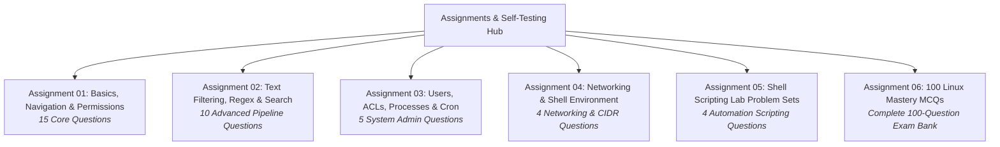

# Assignments & Self-Testing Question Hub

Welcome to the **Assignments & Self-Testing Question Hub**. This portal provides structured problem sets and multiple-choice question banks covering all foundational topics in Linux system administration, storage hierarchy, networking, and shell automation.

---

## 📋 Available Question Banks & Problem Sets

All assignment banks are generated from structured single-source JSON data files (`data/assignments/assignment-XX.json`) and rendered with **interactive collapsible solution blocks** so you can test your knowledge before revealing the detailed explanations.

| Assignment | Topic Coverage | Questions | Interactive Study Link |
| :--- | :--- | :---: | :---: |
| **Assignment 01** | User identity (`id`, `whoami`), directory hierarchies (`mkdir -p`), octal and symbolic `chmod`, `chown`, `chgrp`, `man` pages. | 15 Questions | [Start Assignment 01](assignment-01.md) |
| **Assignment 02** | File operations, `grep` regular expressions, `head`/`tail`, `sort`/`uniq` pipelines, `cut`, `tr`, `find`, `tar`, and `gzip`. | 10 Questions | [Start Assignment 02](assignment-02.md) |
| **Assignment 03** | User/Group administration, `/etc/passwd`, `/etc/shadow`, POSIX ACLs (`setfacl`), process monitoring (`ps`/`top`), `kill` signals, and `crontab`. | 5 Questions | [Start Assignment 03](assignment-03.md) |
| **Assignment 04** | Computer networking, IPv4 CIDR subnetting, socket inspection (`ss`), reachability diagnostics (`ping`, `traceroute`), SSH key authentication, `scp`, `.bashrc`. | 4 Questions | [Start Assignment 04](assignment-04.md) |
| **Assignment 05** | Shell scripting lab problem sets: positional arguments (`$@`), exit codes (`$?`), arithmetic expansions, file test operators (`-s`, `-f`), and signal traps. | 4 Questions | [Start Assignment 05](assignment-05.md) |
| **Assignment 06** | **Linux Mastery 100 MCQs Comprehensive Question Bank**: Full syllabus review with option-by-option explanations for every question. | 100 Questions | [Start Assignment 06 (100 MCQs)](assignment-06.md) |

---

## 💡 How to Use These Self-Study Pages

1. **Attempt Before Revealing**: Read each question carefully and formulate your answer, or test the command in your Linux terminal.
2. **Review Explanations**: Click on the `??? success "Answer & Detailed Explanation"` accordion block.
3. **Understand the Distractors**: Read not only why the correct answer is right, but why the other three options are incorrect or represent different commands.
